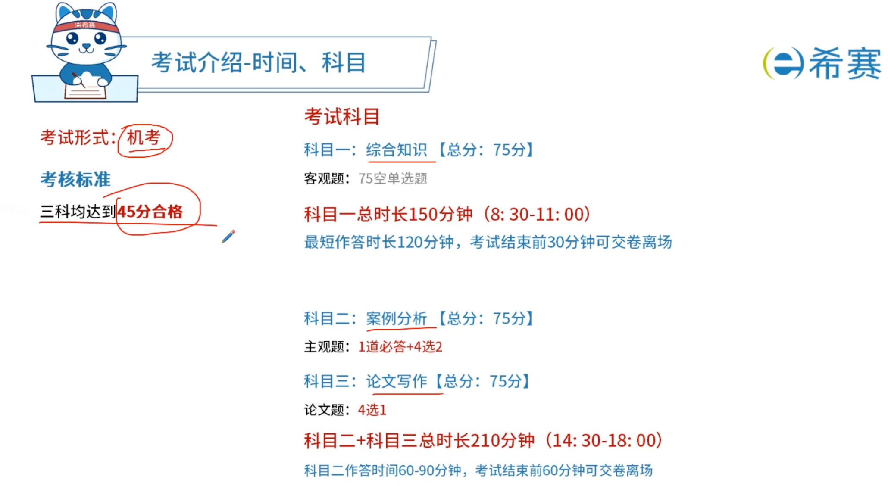

# 熟悉软考

##  系统分析师考试说明

2015-10-28 来源： 中国计算机技术职业资格网

1．考试要求：

（1）具有系统工程的基础知识；

（2）掌握开发信息系统的综合技术知识（硬件、软件、网络、数据库）；

（3）熟悉企业和政府信息化建设，并具有组织信息化战略规划的知识；

（4）熟练掌握信息系统开发过程和方法；

（5）熟悉信息系统开发标准；

（6）掌握信息安全的相关知识与技术；

（7）理解软件质量保证的手段；

（8）具有经济与管理科学的相关基础知识，熟悉有关的法律法规；

（9）具有大学本科的数学基础；

（10）熟练阅读和正确理解相关领域的英文文献。

2．通过本考试的合格人员熟悉应用领域的业务，能分析用户的需求和约束条件，写出信息系统需求规格说明书，制订项目开发计划，协调信息系统开发与运行所涉及的各类人员，能指导制订企业的战略数据规划，组织开发信息系统，能评估和选用适宜的开发方法和工具，能按照标准规范编写系统分析、设计文档，能对开发过程进行质量控制与进度控制，能具体指导项目开发；具有高级工程师的实际工作能力和业务水平。

3．本考试设置的科目包括：

（1）信息系统综合知识，考试时间为150分钟，笔试，选择题；

（2）信息系统分析与设计案例，考试时间为90分钟，笔试，问答题；

（3）信息系统分析与设计论文，考试时间为120分钟，笔试，论文题。

## 考试介绍



## 经验

### 经验一

1.不要总想着猜对题目

2.分不同主题准备素材练习论文

```
至少4篇：系统建模、软件架构设计、系统可靠性分析与设计、系统安全性和保密性设计，有余力有多余时间的话，可以准备系统设计、系统分布式设计的内容。
```

3.注意包含分析（考虑了哪些因素）、讨论（所以做了什么样的决定）和最终如何实施（你是怎么去做的），体现独立性，注意表达方式。

4.准备工作

```
加强学习、平时积累、共同提高
提高写作速度（前期可以打字，后期一定手写，不然看着会不习惯，手写压力也更大，注意字体尽量工整点）
以不变应万变（不变的是你的项目，要深入理解你这个项目，多方面理解。）

好处：项目简介可复用，项目摘要大部分可复用，项目收尾部分可以复用。即使主题完全不同，也基本能保证30%以上的复用度；若主题相近，能达到70%复用度。

好的考试论文写作方法：
    1)灵活的运用可复用的内容
    2）再根据题目要求灵活的做应对
```

Q:项目经验不足怎么办？

没关系，你参与过一个项目就拿这一个项目做基础来展开相关内容的描述。（3000字其实很难看出实践经验水平，论文主体内容不好主要出在理论功底不足）

```
技巧：你的项目可能是信息化体系中的一个子项目。可以把它定义为一个信息化体系的大项目，以其中一个子型项目为例来论述。
```

### 经验二

https://www.cnblogs.com/Tiancheng-Duan/p/11850898.html

文档中描述，系统分析是是一个细化的角色，相比于架构师，分析师跟业务更近。

建议的学习方法：

当然是有的。虽然我在架构师考试博客中推荐了许多书籍，但是分析师的书籍真的几乎没有，所以就不推荐了（毕竟也有一些人认为没有时间看那么多的书籍）。

说一下我的学习方法：

* 首先，看一下教材的目录，了解往年考试情况与分值分布情况。然后有目的性地快速看一遍教材，不求甚解，只求留个印象。
* 其次，配合XMIND，写下各个章节的重点内容，从而建立知识体系（我十分看重建立知识体系，包括面试别人的时候）。
* 然后，配合XMIND，按照重要程度，去细看教材。不大清楚的地方，还会查阅资料，询问群友什么的。
* 最后，就是做题啦，每个章节学习完，都会做章节练习，判断自己对这一章节的认识，并了解题型。另外学完所有章节（起码是自己认为应该学习的章节）后，还会做模拟题（尽量还原出考场的感觉）。最重要的，别忘了错题集，真的有用的。


## 架构师


#### 经验

> 我是个产品，不想考 PMP ，感觉 PMP 虚头巴脑的东西太多，去考的架构，裸考，累计投入了超过 200 小时
>
> 上午成绩：47.00
> 下午成绩：56.00
> 论文成绩：52.00
>
> 有官方教程和答案的（论文除外），我的时间都浪费在看教材上了，实际上啥也别管，就只管刷题就行了，那些刷题小程序里面大概 3000 道题刷完一遍，基本上选择和案例分析就差不多了
>
> 最难的是论文，太久没写字，2 个小时写 2500 字太困难了，哪怕给一篇 2500 字的文章照着抄，也就勉强抄完，我考试前论文就练习了 2 次，第一次抄别人的三个半小时写了 2500 字，第二次自己写 3 个小时写了 2000 字，第三次就上考场了，写到最后 5 分钟还在写，勉强写了 2400 左右


> 因为当时对这个考试很轻视，一开始拿到教材觉得就是一些简单的、需要记忆的东西，希赛那个教材三百多页还是五百多页来着，我大部分时间都花在上面了，直到考试前 10 几天的时候，尝试去做历年的真题才发现，涉及到的知识面怎么这么广，考的很多东西教材里面都没写，看了教材啥也不会，才意识到难度，然后又把不多的时间都投入到了刷题上，刷完题才发现第三门论文这么难，当时其实赶鸭子上架，我选了论湖仓一体架构及应用，我也没想到论文能过，全靠运气，
> 再让我考我会把备考周期放到 3 个月，第一个月看书，第二个月刷题，第三个月写论文


>  软考去年教材大改了， 出的题目如案例题现在大概率是教材上的新知识点，而不是过去常考的知识点。
> 如果你是从事 IT 工作 的程序员，那么没有必要花钱去培训班，都是智商税，我曾经看过希赛老师讲课，那一堂课废话就有一半以上， 其他有用的也就是做题套路而已。
> 淘宝上有文老师软考资料，稍微看看。
> 发的一些 2 到 3 年前的资料就不要看了， 选择题我就每天刷刷题库
> 案例题 看看文毅软考资料 就行了，
> 论文自己多写写，多吹吹，很多论文内容不怎么样都能当范文说明阅卷老师水平也不高，只要字数不差太多，内容没有写偏就可以了。
> 另外记住，选择新的技术和领先的技术的论文话题要远比那些传统软件工程论题得分高，这个论文就要靠平时多积累，多看一些架构师写的内容。

> 高项+架构+系分 3 高的过来人表示，别买任何超过 200 的课。
> 某宝上随便找个 10 块左右的打包课程，不用刷视频和教材，直接看资料总结和刷题就够了。


> 范围广，这个没办法的。我考系分的时候，案例几个题都只会一半，很尴尬；还有一个书上没有的题，是敏捷方法的，只有乱答，反正错了不扣分，正确得分，肯定是多写啊。论文更是，准备的论文边都没靠上，只好乱编。好在软考的论文其实就是命题作文，摘要和开头都一样，就是中间写点靠题意的内容就 OK 。
> 记得我写的论文是可行性，正好之前看书的时候记住可行性的几个要点，然后就随便编了。本来，做软件的有几个是甲方的？基本都是乙方。但是可行性要站在甲方的角度写。那时候还要求手写，好累。


>  8 月之后在开始复习书本知识，剩下的时间都拿来学 java ，尤其是国产框架，去年考了 mycat ，今年会不会考 openresty 或者 mybatis plus ，因为去年考 hibernate 了今年还考？


23的软考高级好像考了很多java的东西？

我应该是看书和总结，不懂的部分再看论文？
